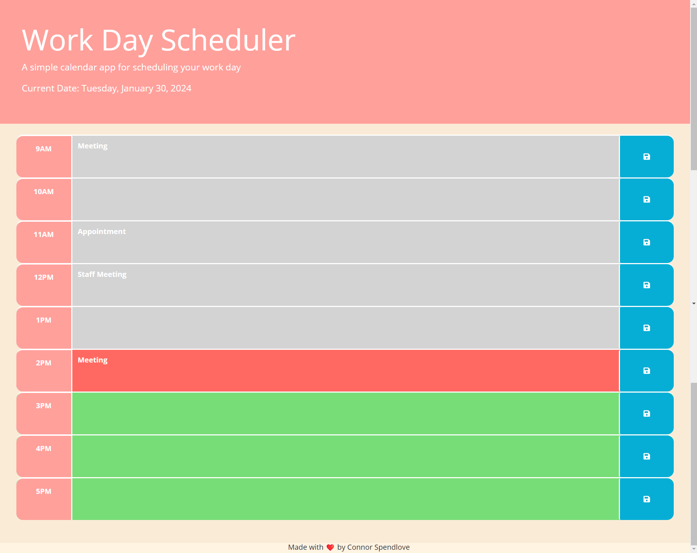

# Daily-Planner

## Description
This app allows users to input events into a daily planner. Then the user is able to store their data into local storage by clicking the save icon. Each time block is styled according to the currnet hour of the day.
## Installation
N/A
## Usage
To use this app, enter events going on at each hour of your work day. Then click the save button. After that you are free to leave the page and return whenever, your data will be saved.
## Deployment Link
[Work Day Scheduler](https://connorspendlove.github.io/Daily-Planner/)
## Screenshot

## License
Please refer to the license in the repo
